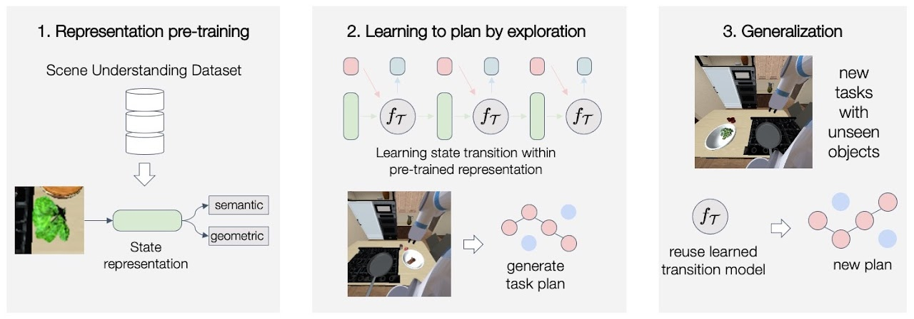
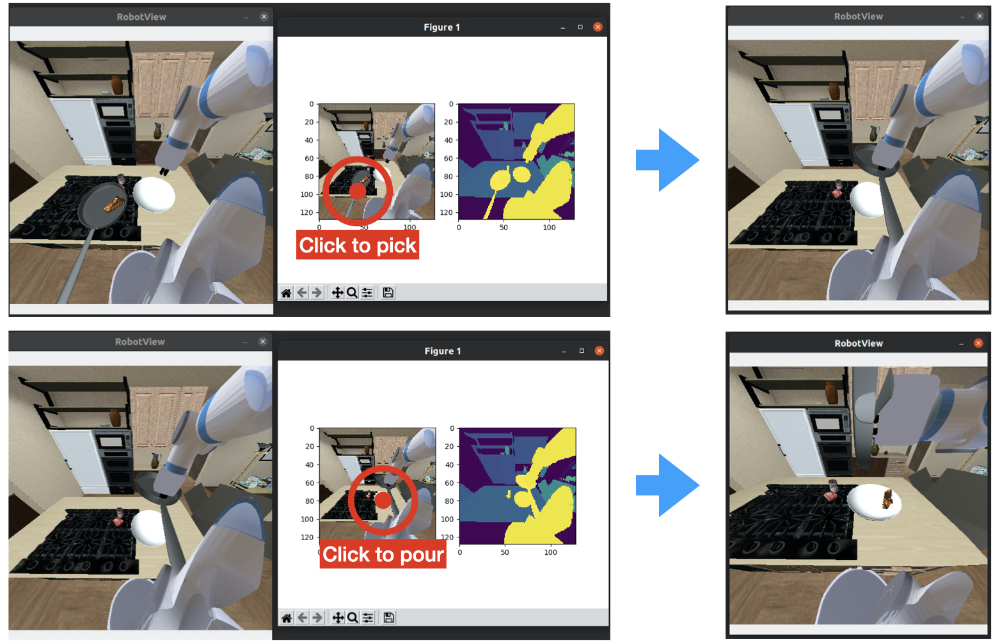

# Generalizable Task Planning through Representation Pretraining

<p align="center">
	
    
</p>

## Table of Content
- [Overview](#overview)
- [Installation](#installation)
- [Datasets](#dataset)
- [Training](#training)
- [Evaluation](#evaluation)
- [Trained Checkpoints](#trained-checkpoints)
- [Data Generation](#data-generation)
- [Acknowledgement](#acknowledgement)
- [Citations](#citations)
- [License](#license)

## Overview

This repository is the **pre-released** implementation code of the paper "Generalizable Task Planning through Representation Pretraining"([arXiv](https://arxiv.org/abs/2205.07993), [Project](https://sites.google.com/view/gentp), [Video](https://drive.google.com/file/d/1S3Th1eJHAH-kjG5EP_sc4ZCbwAOfylg2/view)) by Wang et al. at [Stanford Vision and Learning Lab](http://svl.stanford.edu/). In this repo, we provide the codes for training, evaluation and data generation. In the next step, we will further improve the code structure to better modularize to different scenes.

## Installation
* python 3.6+
```	
conda create -n gentp python=3.8
conda activate gentp
```

* iGibson 1.0 variant version for GenTP. For more details about iGibson please refer to [Link](http://svl.stanford.edu/igibson/)
```	
git clone https://github.com/j96w/iGibson.git --recursive
cd iGibson
git checkout gentp
python -m pip install -e .
```
* Download the modified assets of iGibson (models of the objects, 3D scenes, etc.) through [Link](https://drive.google.com/drive/u/0/folders/1bqcMgnp2k8XBX32--zyrHMKxGFCegbYP). After downloaded the dataset, unzip the folder and move it under your igibson folder as following. Please make sure to rename the folder to `data/`.
```	
unzip BEHAVIOR-data-modified.zip
mv BEHAVIOR-data-modified IGIBSON_PATH/igibson/data
```
* BEHAVIOR BDDL(Behavior Domain Definition Language) 1.0 variant version for GenTP. For more details about BEHAVIOR-100 project please refer to [Link](https://behavior.stanford.edu)
```	
git clone https://github.com/j96w/bddl.git
cd bddl
git checkout gentp
python -m pip install -e .
```

* Final step, install this repo. Also, don't forget to update the path of this repo(`base_path`) and igibson(`igibson_path`) in `GenTP/gentp/configs/base_config.py`
```	
git clone https://github.com/j96w/GenTP-dev.git
cd GenTP
python -m pip install -e .
```

* Quick test the installed environment with your cursor as following. You will see the robot view like the left image. In each interaction step, an interactable image will show up just like the middle image bellow. You can move the cursor to the pixel location that you want to `Pick` or `Place` and click. The robot will then follow the pixel location you selected to execute the corresponding skill. The sequence and number of skills can be easily modified in `gentp/scripts/test_env.py`. 
```
python gentp/scripts/test_env.py
```
<p align="center">
	
</p>

## Dataset
There are two main datasets - one for pretraining the object-centric representation and the other one for learning the transformer-based state transition model. Both datasets are generated through random sampling in the environment. For quick test, you can download the datasets form [Link](https://drive.google.com/drive/folders/1bqcMgnp2k8XBX32--zyrHMKxGFCegbYP?usp=sharing). Note that each dataset contains two splits - for training and validation. If you want to generate your own dataset, please refer to section [Data Generation](#data-generation).
```	
unzip released-datasets.zip
mv released-datasets GenTP/gentp/datasets
```

## Training

The first step is to pre-train the vision-based object-centric representation. After download the datasets, simply 
```	
python gentp/scripts/pretrain_rep.py
```
The trained model will be saved in `gentp/trained_models/`. Choose the best pretrained model and update the `self.pretrained_model` path in `gentp/configs/base_config.py`. In the next step, you will train the transfermer-based state transition model based on the pretrained representation.
```	
python gentp/scripts/train_trans.py
```
The trained transition model will also be saved in `gentp/trained_models/`. Choose the best one and update the `self.eval_model_list` path in `gentp/configs/base_config.py`.

## Evaluation

After updating the `self.eval_model_list` path. You can evaluate the learned model with unseen objects through
```
python gentp/scripts/eval.py
```
This scripts will run a tree search algorithm with the learned representation and transition model to find a parameterized task plan (skill selection and pixel-location selection for skill execution) to achieve the goal purely from image observations. The default goal is **serve the cooked food in the bowl**, which requires the robot to first place the food on the pan to cook it and then lift up the pan to pour the food into the bowl. Note that the food object is an unseen instance that is not included in the training dataset of the transition model. 

## Trained Checkpoints
For quick test, you can download the released trained checkpoints form [Link](https://drive.google.com/drive/u/0/folders/1bqcMgnp2k8XBX32--zyrHMKxGFCegbYP). Unzip the folder and update the `self.eval_model_list` path as previous steps.

## Data Generation

We also provide the scripts we use to generate the datasets for training the representation and transition models in `gentp/scripts/data_generation`.

The dataset used for pre-training the vision-based representation can be generated through the following script. You will see objects sampled randomly in the scene and the symbolic states of each object will also randomly assigned. The goal is to generate a large-scele scene understanding dataset that has mapping from pixel to symbolic predicates (unary ones like **Cooked(A) = True/False** or binary one like **OnTop(A,B) = True/False**).
```
python gentp/scripts/data_generation/pretrain_rep_data_generation.py
```
The dataset used for learning state transition model can be generated with this script. You will see the robot randomly interact with the objects in the scene and the whole sequence of its skill effects will be saved in the dataset. Note that only three objects are used in this data generation process and our algorithm is able to generalize to unseen objects by leveraging the pre-trained representation.
```
python gentp/scripts/data_generation/train_trans_data_datacollection.py
```
Both datasets will be saved in `gentp/datasets/`. You can select the generated dataset and update the loading path (`pretrain_train_data_path`, `trans_train_data_path`) in `gentp/configs/base_config.py`

## Acknowledgement
Code is based on the [BEHAVIOR-100](https://behavior.stanford.edu) and [iGibson](http://svl.stanford.edu/igibson/) projects.

## Citations
Please cite [GenTP](https://sites.google.com/view/gentp) if you find this repository useful
```
@article{wang2022generalizable,
  title={Generalizable Task Planning through Representation Pretraining},
  author={Wang, Chen and Xu, Danfei and Fei-Fei, Li},
  journal={IEEE Robotics and Automation Letters},
  year={2022}
}
```

## License
Licensed under the [MIT License](LICENSE)
